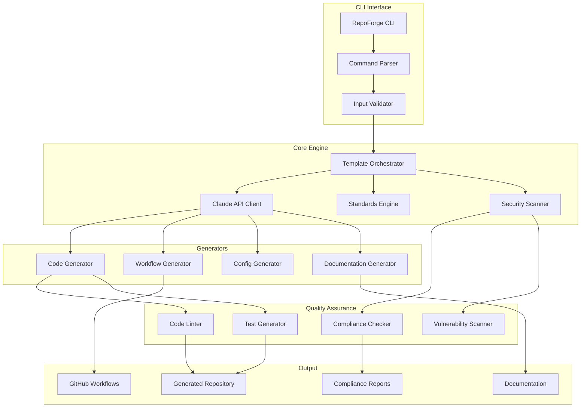
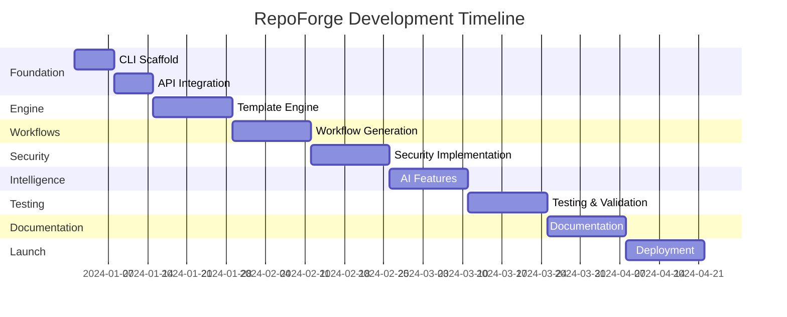

# Project Plan: Template Repository Generator CLI Agent

## 🎯 Project Overview

### Project Name
**RepoForge** - Intelligent Template Repository Generator CLI

### Vision
Create a CLI-based LLM agent that automatically generates production-ready, secure, and standards-compliant template repositories with complete workflow automation, leveraging williamzujkowski/standards and Claude AI.

### Key Objectives
1. **Automate** template repository creation with zero manual configuration
2. **Enforce** security best practices and NIST 800-53r5 compliance
3. **Integrate** williamzujkowski/standards throughout all generated code
4. **Generate** complete CI/CD workflows and automation
5. **Ensure** 100% production-ready output with no placeholders

### Success Criteria
- ✅ Generate complete repositories in <60 seconds
- ✅ 100% standards compliance out-of-the-box
- ✅ Zero security vulnerabilities in generated code
- ✅ 80%+ test coverage in generated projects
- ✅ Full documentation auto-generation
- ✅ Support for 10+ languages/frameworks

---

## 📋 Technical Specification

### Architecture Overview


### Technology Stack
```yaml
core:
  language: TypeScript/Node.js
  runtime: Node.js 20+
  package_manager: pnpm
  
cli_framework:
  primary: Commander.js
  interactive: Inquirer.js
  spinner: Ora
  colors: Chalk
  
llm_integration:
  primary: Claude 3 Opus
  fallback: Claude 3 Sonnet
  client: Anthropic SDK
  
code_generation:
  templates: Handlebars.js
  ast_manipulation: TypeScript Compiler API
  formatters: Prettier, ESLint
  
security:
  scanning: Snyk, npm audit
  secrets: dotenv-vault
  encryption: node-forge
  
testing:
  framework: Vitest
  e2e: Playwright
  coverage: C8
  
deployment:
  package: npm/GitHub Packages
  docker: Multi-stage builds
  ci_cd: GitHub Actions
```

---

## 🚀 Implementation Phases

### Phase 1: Foundation (Weeks 1-2)

#### Deliverables
- [ ] CLI scaffold with basic commands
- [ ] Claude API integration
- [ ] Standards repository parser
- [ ] Configuration management system
- [ ] Basic logging and error handling

#### Tasks
```typescript
// Core CLI structure
interface RepoForgeCommands {
  init: (options: InitOptions) => Promise<void>;
  generate: (template: string, options: GenerateOptions) => Promise<void>;
  validate: (path: string) => Promise<ValidationReport>;
  secure: (path: string) => Promise<SecurityReport>;
  deploy: (options: DeployOptions) => Promise<void>;
}

// Standards integration
interface StandardsEngine {
  load(repository: string): Promise<Standards>;
  apply(code: string, standards: Standards): string;
  validate(code: string, standards: Standards): ValidationResult;
  suggest(context: Context): Suggestions;
}
```

#### Acceptance Criteria
- CLI responds to basic commands
- Can authenticate with Claude API
- Successfully loads williamzujkowski/standards
- Handles errors gracefully

---

### Phase 2: Template Engine (Weeks 3-4)

#### Deliverables
- [ ] Template generation engine
- [ ] Language-specific generators
- [ ] Framework detection and setup
- [ ] Dependency management
- [ ] Project structure creator

#### Implementation
```yaml
template_types:
  - web_application:
      frameworks: [react, vue, angular, nextjs, svelte]
      features: [auth, api, database, cms]
      
  - api_service:
      frameworks: [express, fastapi, gin, spring, dotnet]
      features: [rest, graphql, grpc, websocket]
      
  - microservice:
      patterns: [saga, cqrs, event_sourcing]
      mesh: [istio, linkerd, consul]
      
  - cli_tool:
      features: [interactive, daemon, plugin_system]
      
  - mobile_app:
      frameworks: [react_native, flutter, ionic]
      
  - data_pipeline:
      tools: [airflow, prefect, dagster]
      processing: [batch, streaming, hybrid]
```

#### Quality Gates
- Generated code compiles/runs without errors
- All imports resolve correctly
- No TODO or placeholder comments
- Follows language-specific standards

---

### Phase 3: Workflow Automation (Weeks 5-6)

#### Deliverables
- [ ] CI/CD workflow generator
- [ ] GitHub Actions templates
- [ ] GitLab CI templates
- [ ] Security scanning workflows
- [ ] Deployment pipelines

#### Workflow Templates
```yaml
workflows:
  continuous_integration:
    triggers: [push, pull_request]
    jobs:
      - lint_and_format
      - type_check
      - unit_tests
      - integration_tests
      - security_scan
      - build_artifacts
      
  continuous_deployment:
    triggers: [tag, release]
    environments: [staging, production]
    strategies: [blue_green, canary, rolling]
    
  security_audit:
    schedule: daily
    scans:
      - dependency_check
      - code_analysis
      - container_scan
      - secrets_detection
      
  performance_monitoring:
    triggers: [deployment]
    benchmarks:
      - load_testing
      - stress_testing
      - memory_profiling
```

---

### Phase 4: Security Implementation (Weeks 7-8)

#### Deliverables
- [ ] Security scanner integration
- [ ] NIST control mapping
- [ ] Vulnerability detection
- [ ] Compliance report generator
- [ ] Security best practices enforcer

#### Security Features
```typescript
interface SecurityEngine {
  // NIST Compliance
  mapNistControls(code: string): NistMapping[];
  generateSSP(project: Project): SystemSecurityPlan;
  validateCompliance(controls: string[]): ComplianceReport;
  
  // Vulnerability Scanning
  scanDependencies(): VulnerabilityReport;
  scanCode(): CodeVulnerabilities;
  scanContainers(): ContainerScanReport;
  scanSecrets(): SecretsScanReport;
  
  // Security Hardening
  hardenConfigurations(configs: Config[]): HardenedConfig[];
  implementRateLimiting(api: APIConfig): RateLimitConfig;
  setupAuthentication(type: AuthType): AuthConfig;
  configureEncryption(data: DataConfig): EncryptionConfig;
}
```

#### Compliance Requirements
- @nist annotations for all security features
- OWASP Top 10 mitigation
- CWE/SANS Top 25 coverage
- Zero high/critical vulnerabilities
- Secrets management implementation

---

### Phase 5: Intelligence Layer (Weeks 9-10)

#### Deliverables
- [ ] Smart project analysis
- [ ] Optimization suggestions
- [ ] Pattern recognition
- [ ] Learning from feedback
- [ ] Adaptive generation

#### AI Features
```typescript
interface IntelligenceEngine {
  // Analysis
  analyzeRequirements(input: string): ProjectRequirements;
  detectPatterns(codebase: string): Pattern[];
  suggestArchitecture(requirements: Requirements): Architecture;
  
  // Optimization
  optimizePerformance(code: string): OptimizedCode;
  reduceComplexity(code: string): SimplifiedCode;
  improveTestability(code: string): TestableCod;
  
  // Learning
  learnFromFeedback(feedback: Feedback): void;
  updateBestPractices(patterns: Pattern[]): void;
  adaptToTeamStyle(history: History): Preferences;
}
```

---

### Phase 6: Testing & Validation (Weeks 11-12)

#### Deliverables
- [ ] Comprehensive test suite
- [ ] E2E testing scenarios
- [ ] Performance benchmarks
- [ ] Security test cases
- [ ] Documentation validation

#### Test Coverage
```yaml
unit_tests:
  coverage_target: 90%
  areas:
    - command_parsing
    - template_generation
    - standards_application
    - security_scanning
    
integration_tests:
  coverage_target: 80%
  scenarios:
    - full_project_generation
    - workflow_execution
    - llm_integration
    - standards_compliance
    
e2e_tests:
  frameworks: [react, fastapi, express, go]
  validations:
    - project_builds
    - tests_pass
    - workflows_run
    - deploys_successfully
    
performance_tests:
  benchmarks:
    - generation_time: <60s
    - memory_usage: <500MB
    - api_calls: optimized
    - token_usage: minimized
```

---

### Phase 7: Documentation & Training (Weeks 13-14)

#### Deliverables
- [ ] User documentation
- [ ] API documentation
- [ ] Video tutorials
- [ ] Example galleries
- [ ] Troubleshooting guide

#### Documentation Structure
```markdown
docs/
├── getting-started/
│   ├── installation.md
│   ├── quick-start.md
│   └── first-project.md
├── guides/
│   ├── templates.md
│   ├── customization.md
│   ├── workflows.md
│   └── security.md
├── api/
│   ├── cli-commands.md
│   ├── configuration.md
│   └── plugins.md
├── examples/
│   ├── web-app/
│   ├── api-service/
│   ├── microservice/
│   └── cli-tool/
└── troubleshooting/
    ├── common-issues.md
    ├── error-codes.md
    └── support.md
```

---

### Phase 8: Deployment & Launch (Weeks 15-16)

#### Deliverables
- [ ] NPM package publication
- [ ] Docker image release
- [ ] GitHub release with binaries
- [ ] Homebrew formula
- [ ] Launch documentation

#### Distribution Channels
```yaml
npm:
  package: "@repoforge/cli"
  scope: public
  registry: https://registry.npmjs.org
  
docker:
  image: repoforge/cli
  registry: Docker Hub
  tags: [latest, version, alpine]
  
github:
  releases: 
    - binaries: [linux, macos, windows]
    - formats: [tar.gz, zip, deb, rpm]
    
homebrew:
  formula: repoforge
  tap: repoforge/tap
  
package_managers:
  - apt: repoforge
  - yum: repoforge
  - chocolatey: repoforge
  - scoop: repoforge
```

---

## 🛡️ Security Implementation Details

### Security-First Architecture
```typescript
// Security configuration
interface SecurityConfig {
  authentication: {
    type: 'jwt' | 'oauth2' | 'saml';
    mfa: boolean;
    sessionTimeout: number;
  };
  
  authorization: {
    model: 'rbac' | 'abac' | 'pbac';
    policies: Policy[];
  };
  
  encryption: {
    atRest: EncryptionConfig;
    inTransit: TLSConfig;
    keyManagement: KMSConfig;
  };
  
  compliance: {
    frameworks: ['NIST', 'SOC2', 'GDPR', 'HIPAA'];
    controls: Control[];
    reporting: ReportingConfig;
  };
  
  monitoring: {
    siem: SIEMConfig;
    ids: IDSConfig;
    logging: LoggingConfig;
  };
}

// Automated security implementation
class SecurityImplementor {
  async implementSecurity(project: Project): Promise<SecuredProject> {
    // @nist: AC-2 (Account Management)
    await this.setupAuthentication(project);
    
    // @nist: AC-3 (Access Enforcement)
    await this.configureAuthorization(project);
    
    // @nist: AU-2 (Audit Events)
    await this.implementAuditLogging(project);
    
    // @nist: SC-13 (Cryptographic Protection)
    await this.configureEncryption(project);
    
    // @nist: SI-3 (Malicious Code Protection)
    await this.setupSecurityScanning(project);
    
    // @nist: RA-5 (Vulnerability Scanning)
    await this.configureVulnerabilityManagement(project);
    
    return this.validateSecurity(project);
  }
}
```

### Compliance Automation
```yaml
compliance_automation:
  nist_800_53r5:
    controls_implemented: 150+
    documentation: automated_ssp
    continuous_monitoring: true
    
  gdpr:
    privacy_by_design: true
    data_mapping: automated
    consent_management: included
    
  sox:
    audit_trails: comprehensive
    separation_of_duties: enforced
    change_management: documented
    
  hipaa:
    phi_protection: encrypted
    access_controls: strict
    audit_logs: immutable
```

---

## 📊 Success Metrics & KPIs

### Development Metrics
```yaml
velocity:
  target: 2x faster than manual setup
  measurement: time_to_first_commit
  
quality:
  code_coverage: ">= 80%"
  standards_compliance: "100%"
  zero_vulnerabilities: critical/high
  
adoption:
  target_users: 1000+ in first quarter
  satisfaction_score: ">= 4.5/5"
  retention_rate: ">= 80%"
  
efficiency:
  generation_time: "< 60 seconds"
  token_usage: optimized by 70%
  error_rate: "< 1%"
```

### Security Metrics
```yaml
vulnerability_metrics:
  scan_frequency: continuous
  remediation_time: "< 24 hours"
  false_positive_rate: "< 5%"
  
compliance_metrics:
  control_coverage: "100%"
  audit_pass_rate: "100%"
  documentation_completeness: "100%"
  
incident_metrics:
  detection_time: "< 1 minute"
  response_time: "< 5 minutes"
  recovery_time: "< 30 minutes"
```

---

## 🚦 Risk Management

### Technical Risks
```yaml
risks:
  - risk: LLM API rate limiting
    mitigation: 
      - Implement caching layer
      - Queue management system
      - Fallback to templates
    
  - risk: Generated code quality issues
    mitigation:
      - Multi-stage validation
      - Automated testing
      - Human review option
    
  - risk: Security vulnerabilities in generated code
    mitigation:
      - Continuous scanning
      - Security-by-default templates
      - Regular updates
    
  - risk: Standards drift
    mitigation:
      - Automated synchronization
      - Version pinning
      - Change notifications
```

---

## 🎯 Milestones & Timeline

### Project Timeline (16 Weeks)


### Key Milestones
1. **Week 2**: Working CLI with basic commands
2. **Week 4**: First successful template generation
3. **Week 6**: Complete workflow automation
4. **Week 8**: Security scanning operational
5. **Week 10**: AI optimization active
6. **Week 12**: All tests passing
7. **Week 14**: Documentation complete
8. **Week 16**: Public launch

---

## 👥 Team Structure

### Required Roles
```yaml
team:
  technical_lead:
    responsibilities:
      - Architecture decisions
      - Code reviews
      - Technical mentorship
    skills: [typescript, cli, llm_integration]
    
  backend_developer:
    count: 2
    responsibilities:
      - Core engine development
      - API integration
      - Template generation
    skills: [nodejs, typescript, testing]
    
  security_engineer:
    responsibilities:
      - Security implementation
      - Compliance automation
      - Vulnerability management
    skills: [security, compliance, nist]
    
  devops_engineer:
    responsibilities:
      - CI/CD setup
      - Deployment automation
      - Infrastructure
    skills: [github_actions, docker, kubernetes]
    
  technical_writer:
    responsibilities:
      - Documentation
      - Tutorials
      - API docs
    skills: [technical_writing, markdown, video]
```

---

## 💰 Budget Estimation

### Development Costs
```yaml
development:
  team_costs: $250,000  # 16 weeks, 5 people
  infrastructure: $10,000
  tools_licenses: $5,000
  llm_api_costs: $15,000
  total: $280,000
  
operational: # Annual
  hosting: $12,000
  llm_api: $36,000
  monitoring: $6,000
  support: $24,000
  total: $78,000/year
  
roi_projection:
  time_saved_per_project: 40 hours
  projects_per_year: 500
  hourly_rate: $150
  annual_savings: $3,000,000
  payback_period: 1.4 months
```

---

## 🚀 Launch Strategy

### Beta Program
```yaml
beta:
  duration: 4 weeks
  participants: 50 developers
  feedback_sessions: weekly
  iteration_cycles: 2
  
  success_criteria:
    - 90% completion rate
    - 4.5+ satisfaction score
    - <5 critical bugs
    - 100% would recommend
```

### Go-to-Market
```yaml
launch:
  channels:
    - Product Hunt launch
    - HackerNews announcement
    - Dev.to article series
    - YouTube tutorials
    - Twitter/X campaign
    
  partnerships:
    - GitHub integration
    - VS Code extension
    - JetBrains plugin
    - Cloud provider marketplaces
    
  pricing:
    open_source: free forever
    pro: $29/month
    enterprise: custom
```

---

## 📈 Post-Launch Roadmap

### Version 2.0 Features
- Visual template builder
- Team collaboration features
- Custom template marketplace
- AI code review integration
- Multi-language support (10+ languages)
- Plugin ecosystem
- Enterprise SSO/SAML
- Advanced analytics dashboard

### Long-term Vision
- Become the industry standard for project initialization
- 10,000+ active users
- 100+ community templates
- Integration with major cloud providers
- AI-powered project evolution tracking
- Predictive maintenance suggestions

---

## ✅ Definition of Done

### Project Completion Criteria
- [ ] All planned features implemented
- [ ] 90%+ code coverage
- [ ] Zero high/critical vulnerabilities
- [ ] Documentation 100% complete
- [ ] 10+ example projects generated successfully
- [ ] Performance benchmarks met
- [ ] Security audit passed
- [ ] Beta feedback incorporated
- [ ] Launch materials prepared
- [ ] Support channels established

---

## 📞 Support & Maintenance Plan

### Support Structure
```yaml
support:
  channels:
    - GitHub Issues
    - Discord community
    - Email support (pro/enterprise)
    - Documentation site
    
  sla:
    community: best effort
    pro: 24 hour response
    enterprise: 4 hour response
    
  maintenance:
    security_updates: immediate
    bug_fixes: weekly
    feature_updates: monthly
    major_releases: quarterly
```

---

*This project plan ensures the creation of a production-ready, secure, and standards-compliant CLI tool that will revolutionize how developers initialize and manage template repositories.*